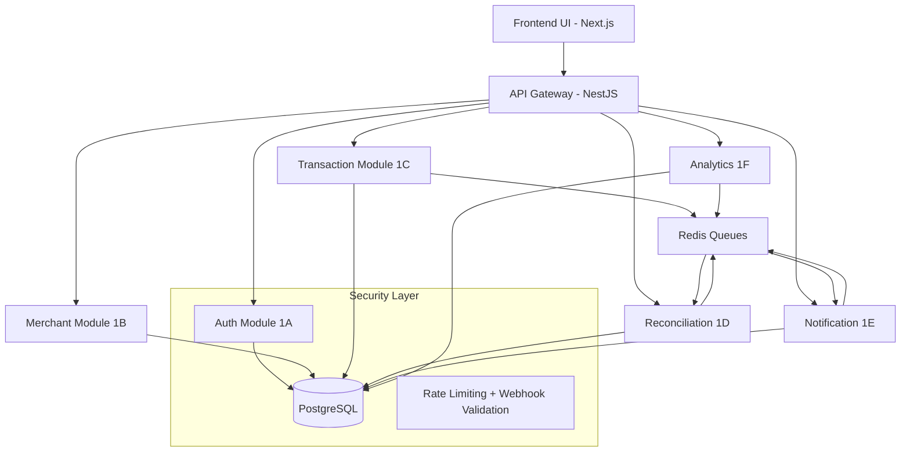

# PHASE 1 FINAL FOUNDATION — LOCKED
**Hedge Fintech App**  
**Owner:** Ridge Dela  
**Status:** COMPLETE — Foundation Ready for Phase 2

## 1. COMPLETE USER FLOWS

### Flow 1 — Merchant Onboarding
Signup → Email Verification → Create Business Profile → Configure Settings → Link MTN MoMo → Connection Verified → Dashboard Activated

### Flow 2 — Incoming Payment
Customer Pays → Provider Webhook → Signature Validation → Raw Event Stored → Normalization → Fraud Checks → Transaction Created → Reconciliation Triggered → Dashboard Updated → Merchant Notified (SMS/Email/Push)

### Flow 3 — Reconciliation Mismatch
Transaction Received → Matching Engine → Mismatch Detected → Flagged → Alert Generated → Merchant Reviews → Manual Resolution/Retry → Audit Log Updated

### Flow 4 — Fraud Alert Flow
Suspicious Pattern Detected → Fraud Rule Triggered → Risk Score Assigned → Alert Created → Merchant Notified → Merchant Fraud History Updated → Admin Review (future)

## 2. MASTER SYSTEM ARCHITECTURE DIAGRAM



Key Interactions: All protected routes use JWT + RBAC. Transactions trigger async reconciliation & notifications via queues.

## 3. API STANDARDIZATION

### Success Response
```json
{
  "success": true,
  "message": "Transaction fetched successfully",
  "data": {},
  "meta": { "pagination": { "page": 1, "limit": 20, "total": 120, "hasNext": true } }
}
```

### Error Response
```json
{
  "success": false,
  "message": "Unauthorized",
  "error": { "code": "AUTH_001", "details": {} }
}
```

### Standard Status Codes
- 200 Success
- 201 Created
- 400 Validation Error
- 401 Unauthorized
- 403 Forbidden
- 404 Not Found
- 409 Conflict
- 429 Rate Limited
- 500 Internal Error

Webhook Security: Timestamp + signature validation, idempotency key, replay prevention, retry queue.
Validation: Class-validator DTOs, whitelist, reject unknown fields.

## 4. OBSERVABILITY BASELINE

Logging: Auth failures, webhook failures, reconciliation failures, notification delivery, fraud rule triggers, risk score assignments, suspicious activity.

Metrics: API latency, failed webhooks, queue failures, DB query times, reconciliation match/mismatch rates, resolution times, fraud alert volume.

Future Ready: Sentry + OpenTelemetry hooks in code structure.
